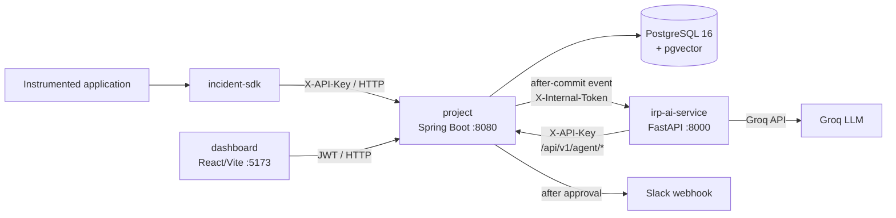

# Agentic AI Incident Response Platform

An incident investigation platform for collecting application telemetry, grouping related
failures, using an AI agent to investigate incidents, and requiring human approval before an
AI suggestion is accepted. This repository contains the incident platform, its Java SDK, and
a separate n8n job-intelligence workflow.

> **Implementation status:** The incident platform is implemented as four independently
> runnable modules. The dashboard starts in mock mode by default. Slack is the implemented
> notification integration; the other integration cards and Automations page are UI-only.
> The n8n workflow is a separate, optional project and is not connected to the incident
> platform.

## Architecture at a glance



The Spring Boot application is the system of record. The AI service has no direct database
connection: it reads telemetry and writes agent runs, steps, and suggestions through the
backend's authenticated agent API. See [`docs/architecture.md`](docs/architecture.md) for
the detailed request, data, security, and deployment flows.

## Repository structure

| Path | Purpose |
|---|---|
| [`project/`](project/) | Spring Boot backend: authentication, tenancy, ingestion, incidents, audit, runbooks, agent APIs, and Slack |
| [`incident-sdk/`](incident-sdk/) | Three-module Java 21 SDK, Spring Boot starter, and demo application |
| [`irp-ai-service/`](irp-ai-service/) | FastAPI investigation worker/API, Groq tool-calling loop, guardrails, and local embeddings |
| [`dashboard/`](dashboard/) | React 18 + TypeScript + Vite human-review dashboard |
| [`n8n-job-intelligence-workflow/`](n8n-job-intelligence-workflow/) | Separate n8n workflow for job discovery, scoring, Google Sheets logging, and Telegram alerts |
| [`docs/`](docs/) | Architecture and system documentation |
| [`.github/workflows/ci.yml`](.github/workflows/ci.yml) | Parallel CI jobs for backend, SDK, AI service, and dashboard |

Generated dependencies and build outputs are intentionally not part of the project structure:
`node_modules/`, `.venv/`, Maven `target/`, dashboard `dist/`, caches, and local environment
files are ignored by [`.gitignore`](.gitignore).

## Main capabilities

- Organization and project tenancy.
- JWT authentication for dashboard users.
- Project-scoped API keys for SDK ingestion and AI-service access.
- Batch ingestion of logs and errors, plus deployment events.
- Manual incidents and optional repeated-error alert grouping.
- Flyway-managed PostgreSQL schema with an append-only audit log.
- Runbook upload and semantic search using local `all-MiniLM-L6-v2` embeddings and pgvector.
- AI investigation with tool calls for searching errors, logs, deployments, and runbooks.
- Persisted agent runs and tool steps for traceability.
- Human approval or rejection of AI suggestions, enforced by the backend.
- Optional Slack notification after an approved suggestion.

## Technology choices

| Area | Technology | Role |
|---|---|---|
| Backend | Java 21, Spring Boot 3.3 | REST API, domain services, security, scheduled alert grouping |
| Persistence | PostgreSQL 16, Spring Data JPA, Flyway | System-of-record data and versioned schema migrations |
| Vector search | pgvector with an HNSW index | Similarity search over runbook chunks |
| AI service | Python, FastAPI, httpx | Asynchronous investigation endpoint and backend client |
| Language model | Groq API with configurable Llama model | Tool-calling reasoning for incident investigations |
| Embeddings | sentence-transformers `all-MiniLM-L6-v2` | Local 384-dimensional runbook/query embeddings |
| Frontend | React 18, TypeScript, Vite, Tailwind CSS | Incident dashboard and human review experience |
| SDK | Java 21, JDK HTTP client, Spring Boot auto-configuration | Non-invasive telemetry capture and delivery |
| Testing | JUnit 5, Mockito, Testcontainers, pytest, respx | Unit, integration, and HTTP-client testing |
| Automation | GitHub Actions | CI for the four incident-platform modules |

## Prerequisites

- Java 21
- Docker Desktop (required for local PostgreSQL; also required by backend Testcontainers tests)
- Python compatible with the AI service requirements (CI uses Python 3.14)
- Node.js 20 and npm
- A Groq API key for live AI investigations

## Local setup

### 1. Start PostgreSQL

The only containerized runtime component currently provided by the repository is PostgreSQL
with pgvector:

```bash
cd project
docker compose up -d
```

The database is exposed on `localhost:5432` with the local development defaults in
[`project/docker-compose.yml`](project/docker-compose.yml). Do not use those defaults outside
local development.

### 2. Run the Spring Boot backend

Flyway applies migrations V1 through V9 on startup. JPA validates the migrated schema rather
than creating it.

```bash
cd project
./mvnw spring-boot:run
```

The API listens on `http://localhost:8080` by default. Backend settings are documented in
[`project/src/main/resources/application.yml`](project/src/main/resources/application.yml),
including `DB_URL`, `DB_USERNAME`, `DB_PASSWORD`, `JWT_SECRET`,
`AI_SERVICE_BASE_URL`, `AI_SERVICE_INTERNAL_TOKEN`, and alert-grouping settings.
Replace development secrets before sharing or deploying the application.

### 3. Run the AI service

```bash
cd irp-ai-service
python -m venv .venv
# Activate .venv using the command for your shell.
pip install -r requirements.txt
copy .env.example .env        # Windows
# cp .env.example .env        # macOS/Linux
uvicorn app.main:app --reload --port 8000
```

Set `IRP_CORE_API_KEY`, `INTERNAL_TOKEN`, and `GROQ_API_KEY` in
[`irp-ai-service/.env.example`](irp-ai-service/.env.example). The API exposes `/health`,
`POST /v1/investigations`, and `POST /v1/embeddings`. The embedding model must be available
to the local sentence-transformers cache when the service starts.

### 4. Run the dashboard

```bash
cd dashboard
npm install
copy .env.example .env        # Windows
# cp .env.example .env        # macOS/Linux
npm run dev
```

Open `http://localhost:5173`. The dashboard uses mock data unless
`VITE_USE_MOCKS=false` is set. For backend-backed operation, use:

```dotenv
VITE_API_BASE_URL=http://localhost:8080
VITE_USE_MOCKS=false
```

The dashboard stores the JWT in browser local storage and sends it as a Bearer token in real
API mode.

## First API flow

Register a user, create a project, and issue a project API key through the backend. Then use
the key for SDK-style telemetry ingestion:

```bash
curl -X POST http://localhost:8080/api/v1/auth/register \
  -H "Content-Type: application/json" \
  -d "{\"organizationName\":\"Acme\",\"fullName\":\"Ada Lovelace\",\"email\":\"ada@example.com\",\"password\":\"change-this-password\"}"

curl -X POST http://localhost:8080/api/v1/auth/login \
  -H "Content-Type: application/json" \
  -d "{\"email\":\"ada@example.com\",\"password\":\"change-this-password\"}"
```

Use the returned `accessToken` as `TOKEN` to create a project and API key:

```bash
curl -X POST http://localhost:8080/api/v1/projects \
  -H "Authorization: Bearer $TOKEN" \
  -H "Content-Type: application/json" \
  -d '{"name":"checkout-service","environment":"production"}'

curl -X POST http://localhost:8080/api/v1/projects/$PROJECT_ID/api-keys \
  -H "Authorization: Bearer $TOKEN" \
  -H "Content-Type: application/json" \
  -d '{"name":"checkout-production"}'
```

Send telemetry with the plaintext key returned once by the API:

```bash
curl -X POST http://localhost:8080/api/v1/ingest/errors \
  -H "X-API-Key: $API_KEY" \
  -H "Content-Type: application/json" \
  -d '{"events":[{"occurredAt":"2026-10-05T10:00:00Z","service":"checkout","message":"Example failure","stackHash":"demo-hash"}]}'
```

The relevant API groups are:

- `/api/v1/auth/*` — registration and login.
- `/api/v1/projects/*` — projects, API keys, incidents, runbooks, agent traces, signals, and Slack.
- `/api/v1/ingest/*` — SDK/application telemetry.
- `/api/v1/agent/*` — AI-service telemetry search and persistence API.
- `/api/v1/audit-logs` — authenticated audit history.

The backend API is the source of truth for request schemas. The module README files contain
additional examples: [`project/README.md`](project/README.md) and
[`incident-sdk/README.md`](incident-sdk/README.md).

## Java SDK

Build the three-module reactor:

```bash
cd incident-sdk
./mvnw clean install
```

The SDK core is Spring-independent; the starter adds automatic exception and latency
capture for Spring Boot applications; the demo app provides local endpoints for exercising
the integration. Configure the starter with the `incident.*` properties described in
[`incident-sdk/README.md`](incident-sdk/README.md), including a real project API key.

## Testing and CI

```bash
cd project && ./mvnw test
cd incident-sdk && ./mvnw test
cd irp-ai-service && pytest -v
cd dashboard && npm run build
```

Backend integration tests use Testcontainers and therefore need Docker. AI-service tests mock
Groq, backend HTTP calls, and model loading. The dashboard has no unit-test runner; its build
performs TypeScript checking and the Vite production build. GitHub Actions runs these four
checks in parallel on pushes and pull requests. The n8n workflow is not covered by CI.

## Security and operational boundaries

- Dashboard routes use stateless JWT authentication with BCrypt password hashing.
- Ingestion and agent routes use project-scoped API keys; keys are hashed and revocable.
- The separate AI service is authenticated by an internal token when the backend starts an
  investigation, then uses an API key for backend agent routes.
- Organization/project scoping is enforced in backend services.
- Suggestions cannot be approved with the AI service's API-key authentication path; approval
  is a dashboard-user operation.
- Spring Actuator exposes health and info endpoints; application logging is configured at
  INFO/DEBUG levels.
- There is no refresh-token flow, fine-grained role enforcement, rate limiting, distributed
  tracing, Kubernetes manifest, or production deployment configuration in this repository.

These are implementation boundaries, not guarantees for a production deployment. Recommended
future work includes secret management, role-based permissions, rate limiting, centralized
observability, durable background-job delivery, and deployment manifests.

## Separate n8n workflow

[`n8n-job-intelligence-workflow/`](n8n-job-intelligence-workflow/) is a standalone self-hosted
n8n workflow. It polls RSS feeds and career pages, optionally reads job-alert email, scores
jobs with Groq, writes to Google Sheets, and sends Telegram alerts. It has its own credentials
and setup instructions and is not part of the incident-platform runtime.

## License and academic use

No license file is currently present. Add an explicit license before distributing the
repository publicly. The code and documentation are suitable as a final-year engineering
project demonstration; verify third-party dependency and API terms before production use.
