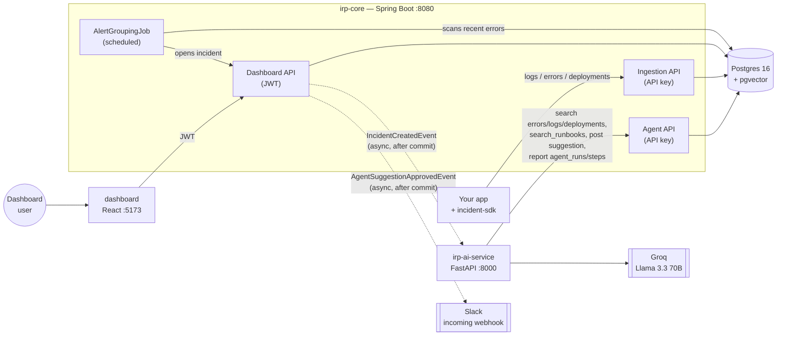

# Agentic AI Incident Response Platform

A four-part platform for finding out *why* something broke in production, faster — an AI
agent does the first pass of investigation over real telemetry, and a human approves or
rejects its reasoning before anything is considered final.

```
Your app + incident-sdk  →  irp-core (backend)  →  irp-ai-service (AI agent)  →  Groq (LLM)
                                    ↕                        ↓
                              dashboard (React)          Slack (on approval)
```

## What it does

1. An app with the **Java SDK** installed reports errors and slow requests automatically —
   zero manual instrumentation.
2. **irp-core** stores everything, tenant-isolated, with an append-only audit trail. Enough
   repeated errors with the same stack hash auto-open an incident on their own.
3. The moment an incident exists, **irp-ai-service** investigates it automatically — it
   calls tools to pull recent errors/logs/deployments, semantically searches uploaded
   runbooks, and proposes a root cause with a confidence score and cited evidence. Every
   tool call it makes is recorded, not just its final answer.
4. A human reviews the AI's reasoning in the **dashboard** and explicitly approves or
   rejects it — enforced server-side, not just in the UI: the AI's own API key is
   structurally incapable of approving its own suggestion. An approval can notify Slack.

## Architecture



The dotted arrows are Spring `ApplicationEvent`s published after a transaction commits and
handled `@Async` — the pattern used everywhere something needs to react to an action without
that action depending on the reaction succeeding. A down AI service can never block or fail
incident creation; an unreachable Slack webhook can never fail an approval.

## Modules

| Module | Stack | What it is |
|---|---|---|
| [`project/`](project/README.md) | Java 21, Spring Boot 3.3, Postgres/pgvector | System of record: auth, tenancy, ingestion, incidents, audit log, AI agent storage, Slack, alert grouping |
| [`incident-sdk/`](incident-sdk/README.md) | Java 21, zero-Spring core + Spring Boot starter | Drop-in dependency for any Spring Boot app: automatic exception + latency capture |
| [`irp-ai-service/`](irp-ai-service/README.md) | Python, FastAPI, Groq, sentence-transformers | The agent: tool-calling investigation loop + local embeddings for RAG |
| [`dashboard/`](dashboard/README.md) | React 18, TypeScript, Vite, Tailwind | Where a human reviews an incident and the AI's reasoning |

## What's real vs. mock

Real, backend-verified, end-to-end: registration/auth, multi-tenant projects, API keys,
ingestion, incidents (manual and auto-created), the full AI investigation loop including
RAG-backed runbook citations, the agent execution trace, human approval (server-enforced),
audit logs, Related Signals, the project-wide AI Copilot queue, and the Slack integration.

Still UI-only mock, and labeled as such in the UI: **Automations** (no rules engine exists)
and the **PagerDuty / GitHub / generic-webhook** integration cards (Slack is the one real
one — see Phase 8 below).

## Quick start

Each module's own README has the full detail; this is the fast path to a working system.

```bash
# 1. Database
cd project && docker compose up -d

# 2. Backend (Flyway migrates on boot)
./mvnw spring-boot:run

# 3. AI service (new terminal)
cd ../irp-ai-service
pip install -r requirements.txt
cp .env.example .env   # fill in GROQ_API_KEY (free at console.groq.com/keys)
uvicorn app.main:app --reload --port 8000

# 4. Dashboard (new terminal)
cd ../dashboard
npm install
npm run dev   # http://localhost:5173, mock data by default
```

To point the dashboard at the real backend instead of mock data, copy `dashboard/.env.example`
to `.env` and set `VITE_USE_MOCKS=false`.

## Demo script (~2 minutes)

1. **Register + create a project** — `curl` examples in [`project/README.md`](project/README.md#example-requests).
   Issue an API key for the project.
2. **Upload a runbook** from the dashboard's Runbooks page (or `PUT .../runbooks`) describing
   a fix for a specific error, e.g. *"NullPointerException in checkout → missing null-check
   after a deploy, roll back or add a guard."*
3. **Send a matching error** through the API key (`POST /api/v1/ingest/errors`) — a
   `NullPointerException` in `checkout`, plus a recent deployment via `POST .../deployments`.
4. **Create an incident** referencing that error (or send ≥5 identical errors within 10
   minutes with `ALERT_GROUPING_ENABLED=true` and watch one get created automatically).
5. **Watch it investigate itself** — no manual trigger. Within a few seconds the incident
   moves to `AWAITING_APPROVAL` with a root cause, a confidence score, and evidence that
   **cites the runbook you uploaded**, not just the raw error.
6. **Open the incident in the dashboard** → **Agent Trace tab**: every tool call the agent
   made, in order, with its real input and output — not just the final answer.
7. **Approve the suggestion**. If a Slack webhook is connected (Integrations page), a
   notification posts automatically.
8. **Check the Audit Log page** — every step above left a row: who, what, when.

## Testing & CI

```bash
cd project && ./mvnw test          # 7 unit tests always run; 3 Testcontainers-backed
                                    # integration tests need Docker (works on most machines
                                    # and on GitHub Actions; see project/README.md)
cd incident-sdk && ./mvnw test     # 33 tests, including a real (non-mocked) HTTP wire-format test
cd irp-ai-service && pytest -v     # 34 tests, everything mocked, ~6s, no API keys needed
cd dashboard && npm run build      # typecheck + production build
```

[`.github/workflows/ci.yml`](.github/workflows/ci.yml) runs all four in parallel on every
push and PR.

## Tech stack

| Category | Technologies |
|---|---|
| Backend | Java 21, Spring Boot 3.3, Spring Security, Spring Data JPA, Flyway |
| Frontend | React 18, TypeScript, Vite, Tailwind CSS, TanStack Query, Recharts |
| Database | PostgreSQL 16 + pgvector (HNSW index for runbook search) |
| AI | Groq (Llama 3.3 70B, tool calling), sentence-transformers (local embeddings, free) |
| SDK | Plain Java 21 core (zero Spring dependency) + Spring Boot auto-configuration |
| Testing | JUnit 5, Mockito, AssertJ, Testcontainers, pytest, respx |
| CI/CD | GitHub Actions (4 parallel jobs) |

## Interview talking points

**"Walk me through the architecture."** Four independently-runnable services talking only
over HTTP, the way they would if built by four different teams: a Spring Boot system of
record, a Java SDK that removes ingestion friction, a Python AI agent that reasons over
real data with tool calling, and a React dashboard that's the human checkpoint.

**"What makes the AI part 'agentic' rather than just an LLM call?"** It decides which tools
to call and in what order (search errors → check deployments → search runbooks → post a
result), grounds its confidence in retrieved evidence (a guardrail caps confidence to 0.3
if it can't cite anything), and every one of those tool calls is persisted and visible in
the dashboard's Agent Trace tab — not just the final answer.

**"How do you know the human-approval gate is real, not just a UI convention?"** The
review endpoint is JWT-only. The AI service authenticates with an API key. Those are two
separate Spring Security filter chains matched by path — the AI's own credentials are
structurally incapable of hitting the approval endpoint, regardless of what the UI does.

**"What's the most interesting bug you hit building this?"** A Hibernate-buffered-insert
ordering bug: uploading a runbook inserted its chunks via raw JDBC (no ORM mapping exists
for a `vector(384)` column), but Hibernate hadn't flushed the parent row yet, so the first
upload failed a foreign-key check that should have been impossible. Fixed with
`saveAndFlush`. A close second: a Windows Application-Control policy silently blocking
PyTorch's DLL load mid-session — a reminder that "works locally" and "works in this
environment" aren't the same claim.

**"What would you build next?"** Real OAuth-based integrations beyond Slack (PagerDuty,
GitHub), a real automation-rules engine (the Automations page's actual missing backend),
and role-based authorization — the JWT already carries `OWNER`/`ADMIN`/`MEMBER`, but
nothing checks it yet, so every user in an org can currently do everything any other user
can.

## Enhancement history

This started as a working four-phase prototype (see each module's own README for that
original scope) and went through ten further phases, each independently committed and
verified live against a running instance, not just unit-tested in isolation:

1. Event-driven auto-trigger — incidents auto-investigate on creation, no manual call
2. Real RAG pipeline — local embeddings + pgvector search, replacing a stub that always
   returned nothing
3. Agent execution trace — every tool call persisted and shown in the dashboard
4. Responsive mobile navigation
5. Alert grouping — repeated errors auto-open one incident, not five
6. Tenant isolation & validation hardening — found and fixed a real cross-org data leak
7. AI service test suite (34 tests) + GitHub Actions CI across all four modules
8. Real Slack integration — the one working integration, not a mock card
9. Backend-real Related Signals + AI Copilot queue — the last two mock-data banners removed
10. This document
