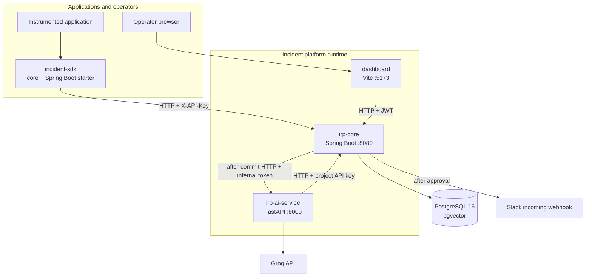
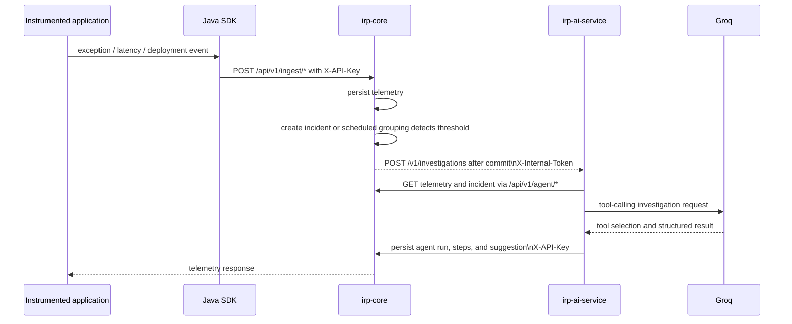
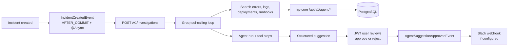
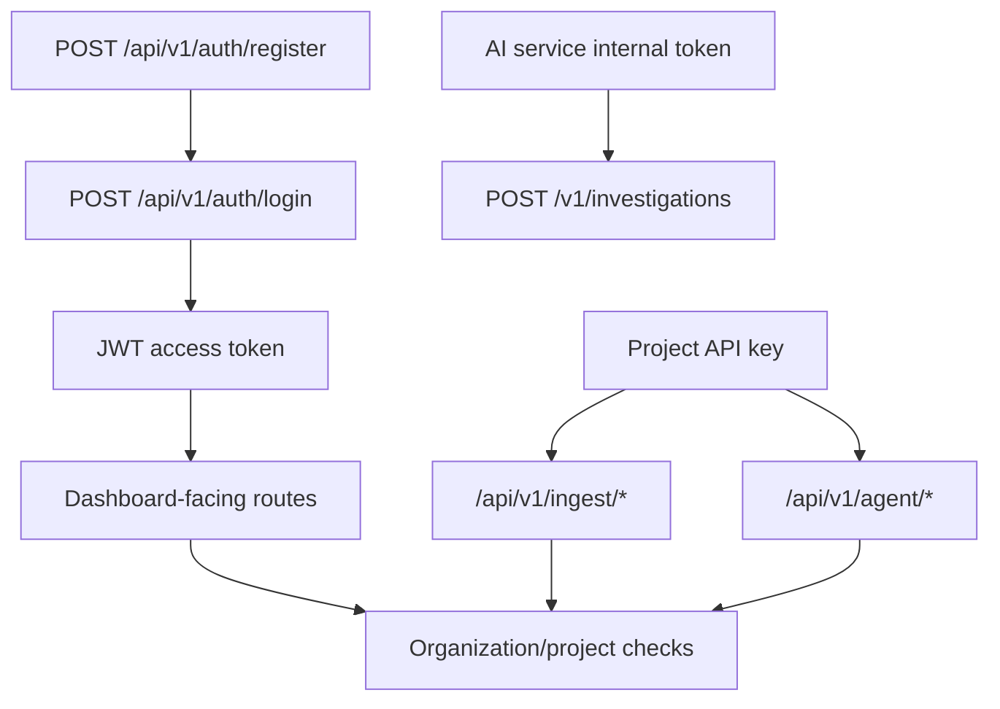
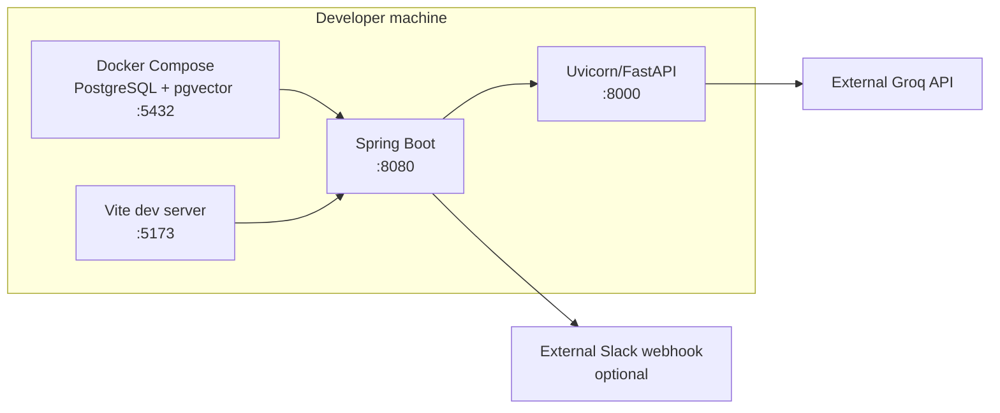

# Architecture

This document describes the implementation currently present in the repository. It does not
describe a planned Kubernetes deployment or any service that is not implemented.

## System boundaries

The incident platform has four independently runnable modules:

1. **`project/` (`irp-core`)** — Spring Boot system of record and public REST API.
2. **`irp-ai-service/`** — FastAPI investigation and embedding service.
3. **`dashboard/`** — React/Vite client for operators.
4. **`incident-sdk/`** — Java SDK, Spring Boot starter, and demo application used by
   instrumented applications.

`n8n-job-intelligence-workflow/` is a separate automation project. It is not called by, and
does not call, the incident platform.

## High-level architecture

The backend owns persistence and tenancy. The AI service never opens a database connection.
The dashboard can run against in-memory mock services, but real mode uses the backend API.

## Backend responsibilities

The Spring application is organized by domain rather than deployed as separate services:

- `auth` — registration, login, JWT issuance.
- `tenancy` — organizations, users, projects, and API keys.
- `ingestion` — logs, errors, deployments, and stack-hash data.
- `incident` — incident CRUD, timeline entries, and scheduled repeated-error grouping.
- `agent` — investigation API, run/step/suggestion persistence, runbooks, embeddings, and
  approval workflow.
- `integrations/slack` — project webhook configuration and approval notifications.
- `common/audit` — append-only audit records and shared error handling.
- `security` — JWT and API-key filter chains.

## Service-to-service communication

The backend event listener is asynchronous and runs after the incident transaction commits.
Therefore AI-service availability does not determine whether incident creation succeeds.

## Request and data flow

### Telemetry and incident flow

1. An application uses the SDK or calls ingestion endpoints directly.
2. `irp-core` authenticates the project API key and stores logs, errors, or deployments.
3. An incident can be created through the dashboard API, or the scheduled alert-grouping job
   can create one when repeated errors meet the configured threshold and time window.
4. An after-commit event invokes the AI service.

### AI investigation flow

### Runbook RAG flow

Runbook upload is handled by `irp-core`. The backend asks the AI service for embeddings at
`POST /v1/embeddings`, stores 384-dimensional vectors in `runbook_chunks`, and searches them
with PostgreSQL/pgvector. The AI service's `search_runbooks` tool calls the backend, which
performs the database query. Migration V7 is the effective schema change from the original
1536-dimensional placeholder to 384 dimensions.

## Persistence

Flyway migrations V1–V9 create and evolve:

- organizations, users, projects, and API keys;
- log, error, and deployment events;
- incidents and timeline entries;
- audit logs;
- runbooks and vectorized runbook chunks;
- agent runs, agent steps, and agent suggestions;
- Slack integrations.

JPA is configured with `ddl-auto: validate`; Flyway owns schema changes. Runbook vector
storage uses direct JDBC because the application does not map pgvector as a regular JPA field.
The database is provisioned locally by `project/docker-compose.yml` using
`pgvector/pgvector:pg16`.

## Authentication and authorization

- Dashboard routes use `Authorization: Bearer <JWT>`.
- SDK ingestion and AI-service agent calls use `X-API-Key`.
- The backend calls the AI service with `X-Internal-Token`.
- Passwords use BCrypt; API keys are stored hashed and can be revoked.
- Roles are present in the JWT model, but fine-grained role checks are not currently
  demonstrated throughout the application.
- There is no refresh-token or logout endpoint.

## External integrations

- **Groq:** configurable model endpoint used by the AI investigation loop.
- **sentence-transformers:** local `all-MiniLM-L6-v2` model for embeddings.
- **Slack:** optional project webhook notification after approval.
- **n8n / Google Sheets / Telegram / IMAP / RSS:** used only by the separate job-intelligence
  workflow, not by `irp-core`.

## Local deployment architecture

Only PostgreSQL has a repository-provided Docker Compose definition. There are no Dockerfiles
for the application modules, Kubernetes manifests, cloud deployment descriptors, service
discovery, or production infrastructure-as-code files.

## Reliability and observability currently present

- SDK delivery uses asynchronous dispatch and retry policy.
- AI invocation and Slack notification are asynchronous after-commit listeners.
- Backend Actuator exposes health and info endpoints.
- Application logging is configured through Spring and Python logging.
- Agent tool calls are persisted for investigation traceability.
- Backend integration tests use Testcontainers; CI runs backend, SDK, AI-service, and dashboard
  checks in separate GitHub Actions jobs.

The repository does not currently implement distributed tracing, metrics dashboards,
rate-limiting, a durable external queue, multi-instance coordination, or a production
deployment strategy. Those are future improvements rather than current capabilities.
